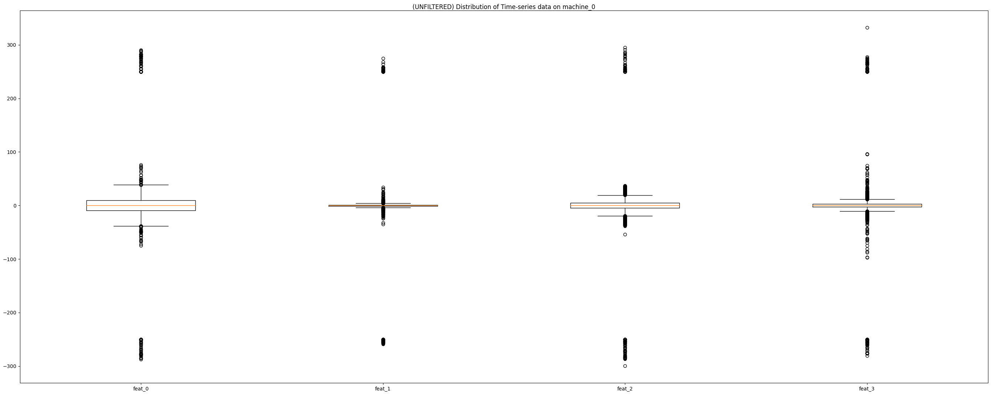

# David David
## _Tagup Data Engineering Challenge_

The original challenge can be found [here](https://github.com/tagup/ops-challenges/tree/master/data-engineering).

## Section 1: First Impressions on the Data
1. There are two kinds of tables in the ```exampleco_db.db``` database:
   - Time-series data that for every machine, tracks equipment metrics that change over time such as the values of ```feat_0```, ```feat_1```, ```feat_2```, ```feat_3```
   - Static data that for every machine, stores facts that are rarely (if ever) updated like a machine's ```room``` location
2. In the Time-series tables:
   - Every row is sorted by ```timestamp``` and then sorted again by ```machine```
   - Every (```timestamp```, ```machine```) pair in ```feat_0``` are the same pairs in ```feat_1```, ```feat_2```, ```feat_3```

## Section 2: Objectives
1. Mapping the Time-series equipment data
2. Cleaning the Timer-series equipment data
3. Why is this design and approach effective?


### Section 2.1: Mapping the Time-series equipment data
For this objective, there are two approaches that come to mind:
1. The simple approach of imitating the structure of the tables in the database. One way this can be done is by making a 3-Dimensional Structure like in the diagram below. This structure in Pandas ```DataFrame```s has 240,000 rows that consume 40MB.
```
      +────────────+──────────+────────+
     /             feat_4             /|
    +────────────+──────────+────────+ |
   /              feat_2            /| |
  +────────────+──────────+────────+ | |
 /               feat_1           /| | |
+────────────+──────────+────────+ | | |
|             feat_0             | | | |
+────────────+──────────+────────+ | | |
| timestamp  | machine  | value  | | | |
+────────────+──────────+────────+ | | |
| ts0        | m0       | v0     | | | |
| ts1        | m1       | v1     | | | |
| ...        | ...      | ...    | | | |
| tsn        | mn       | vn     | | | |
|            |          |        | | | |
|            |          |        | | | /
|            |          |        | | |/
|            |          |        | | /
|            |          |        | |/
+────────────+──────────+────────+ /
```
2. The complex (but more compact) approach of minimizing repeated data. One way this can be done is by making another 3-Dimensional Structure like in the diagram below. This structure in Pandas ```DataFrame```s has 60,000 rows that consume 7MB. That's a 75% decrease in the number of rows and an 82% decrease in memory/storage. 
```
      +────────────+─────────+─────────+─────────+─────────+
     /                       machine_20                   /| 
    +────────────+─────────+─────────+─────────+─────────+ |
   /                          ...                       /| |
  +────────────+─────────+─────────+─────────+─────────+ | |
 /                       machine_1                    /| | |
+────────────+─────────+─────────+─────────+─────────+ | | |
|                       machine_0                    | | | |
+────────────+─────────+─────────+─────────+─────────+ | | |
| timestamp  | feat_0  | feat_1  | feat_2  | feat_3  | | | |
+────────────+─────────+─────────+─────────+─────────+ | | |
| ts0        | f00     | f10     | f20     | f30     | | | |
| ts1        | f01     | f11     | f21     | f31     | | | |
| ...        | ...     | ...     | ...     | ...     | | | |
| tsn        | f0n     | f1n     | f2n     | f3n     | | | |
|            |         |         |         |         | | | |
|            |         |         |         |         | | | |
|            |         |         |         |         | | |/
|            |         |         |         |         | | / 
|            |         |         |         |         | |/
+────────────+─────────+─────────+─────────+─────────+ /
```

### Section 2.2: Cleaning the Timer-series equipment data
Before Cleaning            |  After Cleaning
:-------------------------:|:-------------------------:
  |  

Interquartile Range (IQR) is a measurement of the spread of data. By filtering data points that are too far away from the typical value in a data set, we get to clean the outliers off of the data. This filtering is implemented in the ```remove_outliers``` function in ```data_frame_helper.py```:
```
# remove_outliers(pandas DataFrame, [str]) -> pandas DataFrame
def remove_outliers(df_in, cols):
    # get the value at the first and the third quarter of our data set
    q1 = df_in[cols].quantile(0.25)
    q3 = df_in[cols].quantile(0.75)
    iqr = q3-q1

    # filter out the outliers
    df_out = df_in[~((df_in[cols]<(q1-1.5*iqr)) | (df_in[cols]>(q3+1.5*iqr)).any(axis=1))]
    return df_out
```

### Section 2.3: Why is this design and approach effective?
The second approach from Section 2.1 was used for two reasons:
1. We save memory by eliminating redundant data. For example, ```feat_0```, ```feat_1```, ```feat_2```, ```feat_3``` all contain the (```timestamp```, ```machine```) pairs as seen in the figure below. We get to minimize server fees because those tend to be measured from two metrics:
   - Memory/storage space
   - Processing time, which is generally smaller when Memory/storage space is smaller

| timestamp | machine | value |
| ------ | ------ | ------ |
| 2019-01-01 00:00:00.000000000 | machine_0 | [different values] |
| 2019-01-01 08:00:09.603201067 | machine_0 | [different values] |
| 2019-01-01 16:00:19.206402134 | machine_0 | [different values] |
| 2019-01-02 00:00:28.809603201 | machine_0 | [different values] |
| 2019-01-02 08:00:38.412804268 | machine_0 | [different values] |
| ... | ... | ... |
2. The first approach from Section 2.1 lets us see one metric (like ```feat_0```) for all machines, which is useful if we want the "big picture" of a certain metric on all of our machines. On the other hand, the implementation of the second approach takes in all the metrics (```feat_0```, ```feat_1```, ```feat_2```, ```feat_3```) of one machine. This lets us zoom in and see the relationship between the metrics over the lifespan of the machine, as seen in the figure below. For example, we can begin tackling the following questions:
   - Does ```feat_0``` increase or decrease when ```feat_1``` increases?
   - Does ```feat_2``` spike when the rest of the metrics do?
   - If a few machines failed at a certain date, did any of the metrics give us insights related to the machine failure?
   - etc


Also, the data from Section 2.2 was cleaned off of outliers using IQR because:
1. Data accuracy is essential in analysis. However, since the metrics are measured by physical sensors, some data points may be exaggerated by external factors which are generally not useful when tracking trends. For example, a wind farm in Texas may have measured that there was massive drop in temperature around February 13-17, 2021. By ignoring the data from that week, we avoid skewing the data to lower temperatures and avoid drawing false conclusions.
